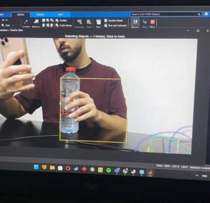
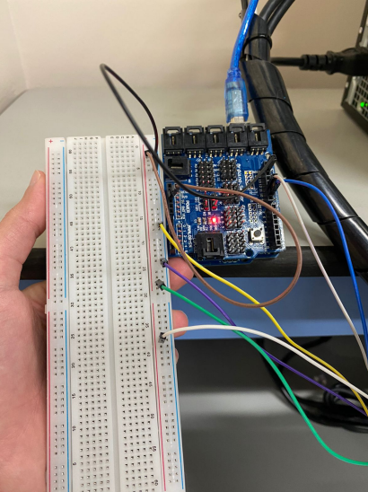

# Smart Camera Object Tracking (PID + Particle Filter)

Vision-based smart camera system that detects a moving subject using motion-based tracking, then switches to a particle filter for robust tracking under camera motion. A PID controller drives servo motors (pan/tilt) to keep the target centered in the frame.

## Highlights
- Motion-based multiple object detection + tracking
- Particle filter single-object tracking under camera motion
- PID control using frame-center error signal
- Arduino + MATLAB servo control integration

## Files
- `Computer_Vision_Project_Report.pdf` — full report with methodology, results, and outputs

## Initial Object Detection

The system detects foreground objects and extracts pixel-level features to initialize tracking.

## Hardware Setup

Arduino-controlled pan-tilt system used to physically track the detected object in real time.

